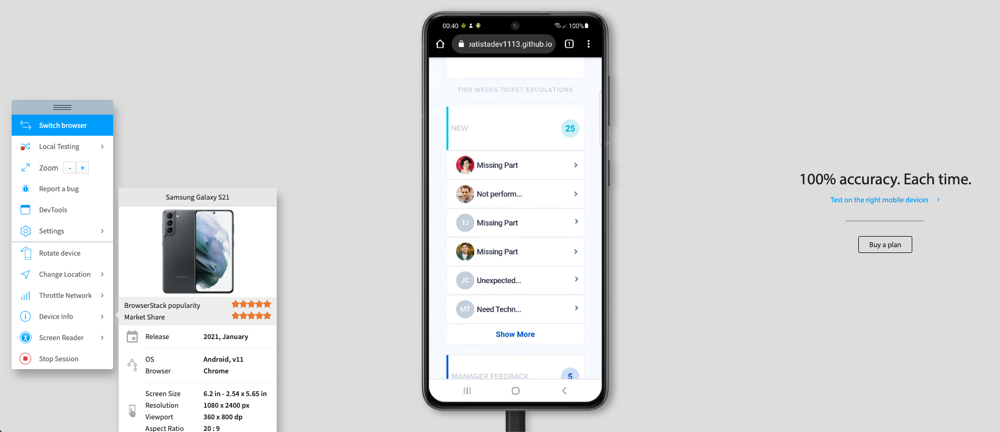
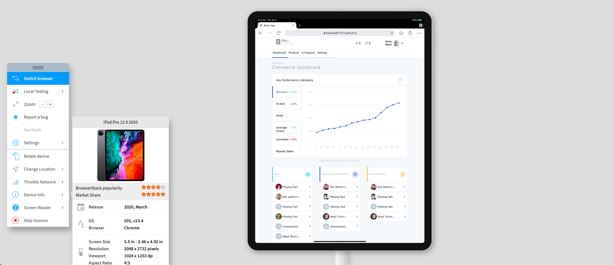
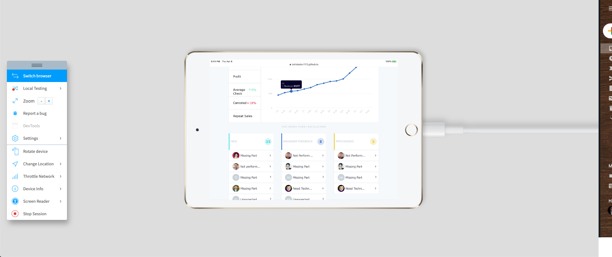
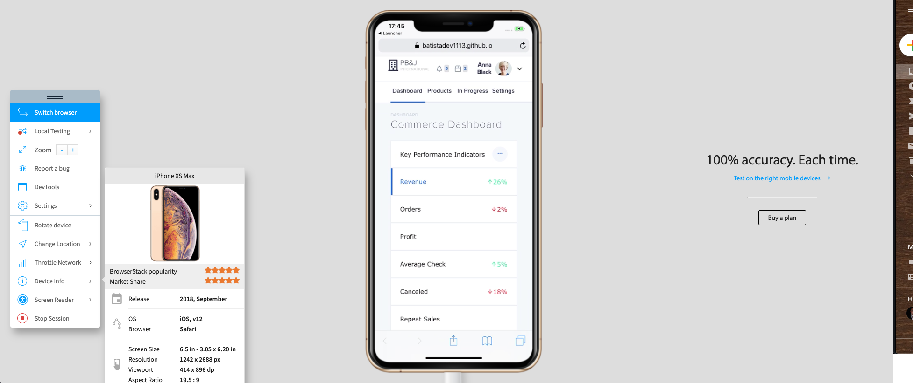

# Playbook Ui test

## How to run the project locally?

- clone repo
- run npm install to get all required dependencies
- run `npm start` after installation is completed. You should be able to see the project running on your browser on port 3000.

### Some screenshots below:

I hope you like it 👨🏻‍💻

Thank you for visiting!
